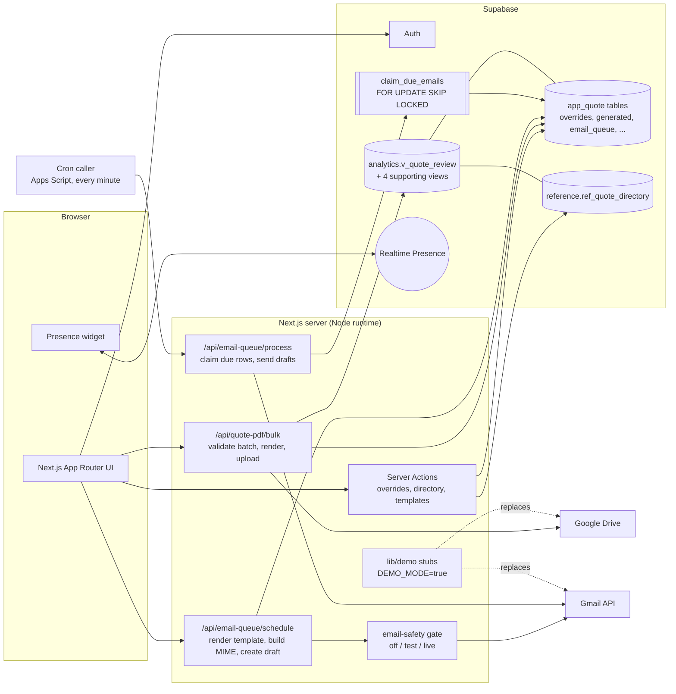

# Quote Automation

A web app that turns a worklist of field-service tasks into reviewed, priced
quote PDFs and scheduled quote emails.

**What it does.** Accounting staff open a queue of tasks that need a quote. Each
task is already matched to its priced invoice line and to the right recipients.
They fix what needs fixing (wrong category, several possible prices, no
recipient), generate the PDFs one at a time or in bulk, and schedule the emails.

**How it works.** A Postgres view joins the task list, the invoice lines, a
recipient directory and the staff's manual overrides into one row per task. A
Next.js app reads that view, renders PDFs on the server with `@react-pdf`,
files them in Google Drive, and creates Gmail drafts that a queue processor
sends at the scheduled time.

**Result.** The internal version took the accounting team from 20-30 quotes a
day to over 100.

This repository is a sanitized public copy of that internal tool. It runs end to
end in a **demo mode** with invented data, where nothing is uploaded and nothing
is sent.

Screenshots: see [`docs/screenshots/`](docs/screenshots/) (none captured yet).

## Architecture



All database access happens on the server with the service-role key, after the
caller has been authenticated and checked against an email allowlist. The
browser only talks to Supabase for sign-in and for the Realtime Presence channel.

## Run the demo

You need Node 20+ and a free Supabase project. About ten minutes.

1. **Create a Supabase project** at supabase.com. Wait for it to finish
   provisioning.
2. **Create the schema and data.** In the dashboard's SQL Editor, run
   [`supabase/schema.sql`](supabase/schema.sql), then
   [`supabase/seed.sql`](supabase/seed.sql). (Or with psql:
   `psql "$DB_URL" -v ON_ERROR_STOP=1 -f supabase/schema.sql -f supabase/seed.sql`.)
   Both files can be re-run safely.
3. **Expose the schemas.** Project Settings -> API (Data API) -> Exposed
   schemas: add `analytics`, `data_staging`, `reference`, `app_quote`. Save.
   Without this every page fails with "schema must be one of the following".
4. **Create the demo user.** Authentication -> Users -> Add user -> Create new
   user. Email `demo@example.com`, a password of your choice, tick
   **Auto Confirm User**. The Email provider must be enabled (it is by default).
5. **Set the environment.**
   ```bash
   npm ci
   cp .env.example .env.local
   ```
   Fill in `NEXT_PUBLIC_SUPABASE_URL`, `NEXT_PUBLIC_SUPABASE_ANON_KEY`,
   `SUPABASE_SERVICE_ROLE_KEY` (Project Settings -> API), and
   `DEMO_USER_PASSWORD` (the password from step 4). Keep `DEMO_MODE=true`.
   No Google credentials are needed.
6. **Run it.** `npm run dev`, open http://localhost:3000, click **Enter demo**.

Things to try: filter the queue by status; open a task with several priced
options and choose one; verify a "needs review" task; assign recipients to a task
with no directory match; bulk-generate a selection (a selection containing a
problem row is refused as a whole); open a generated PDF; connect the fake
mailbox under Settings and schedule an email; watch it move to Sent in the Outbox
once its time passes.

To put the data back: run [`supabase/reset_demo.sql`](supabase/reset_demo.sql),
or `select demo.reset_demo();`.

### What demo mode changes

`DEMO_MODE=true` is a single server-side switch. The stubs live in
[`lib/demo/`](lib/demo/); each real integration checks the flag once at its
boundary. With the flag off, the original code paths run.

| Area | Normal | Demo mode |
| --- | --- | --- |
| Sign-in | Google OAuth through Supabase Auth, email allowlist | "Enter demo" signs in `demo@example.com` with a server-held password; that user is allowlisted automatically |
| Drive | PDFs uploaded to a Drive folder | Nothing stored. The quote gets a fake file id, and "open PDF" points at `/api/quote-pdf`, which renders it on request |
| Gmail | Drafts created in the user's mailbox, sent on schedule | Create/send/delete return fake ids. Queue rows still move through scheduled, sent, cancelled. Nothing leaves the server |
| Connect Gmail | Google consent screen | Records a fake mailbox row |
| Email gate | `QUOTE_EMAIL_MODE` decides | Forced to `test`; can never be `live` |
| Queue processing | External cron calls the processor | Due rows are settled when the Outbox is loaded |
| PM API login | Verified against the upstream API, password stored encrypted | Always succeeds; the typed password is not stored |
| UI | | Banner: "Demo data. Nothing is sent." |

## Deploy the demo to Vercel

1. Do steps 1-4 of "Run the demo" against the Supabase project the deployment
   will use.
2. Import the repository into Vercel (framework preset: Next.js, defaults are
   fine).
3. Set these environment variables for Production: `DEMO_MODE=true`,
   `DEMO_USER_PASSWORD`, `NEXT_PUBLIC_SUPABASE_URL`,
   `NEXT_PUBLIC_SUPABASE_ANON_KEY`, `SUPABASE_SERVICE_ROLE_KEY`,
   `NEXT_PUBLIC_APP_URL` (the deployment URL). Leave every Google, Gmail, PM API
   and email-mode variable unset.
4. `vercel.json` pins the functions to one region (`sin1`). Change it to the
   region closest to your Supabase project before deploying.
5. In Supabase, Authentication -> URL Configuration: set Site URL to the
   deployment URL. Under Authentication -> Sign In / Providers, turn off "Allow
   new users to sign up" so the demo user is the only account.
6. Schedule the nightly reset so visitors cannot leave junk behind: enable the
   `pg_cron` extension, run `supabase/reset_demo.sql` once, then run the
   `cron.schedule(...)` statement from that file's header.

The bulk and scheduling routes declare `maxDuration` up to 300 seconds. Check
that your Vercel plan allows that, or lower the values.

All demo visitors share one user, so they see each other's edits until the next
reset. That is intended for a demo and is the reason the reset exists.

## Running it for real (demo mode off)

Set `DEMO_MODE` to anything but `true` and provide the rest of
[`.env.example`](.env.example): Google sign-in configured in Supabase Auth, the
allowlist, a Drive OAuth client plus folder id, a Gmail OAuth client plus token
key, the email-mode switches and queue secret, and a cron caller for
`POST /api/email-queue/process` ([`scripts/email_queue_trigger.gs`](scripts/email_queue_trigger.gs)
is an Apps Script example). You also need your own data behind the
`analytics.*` views; the `demo.*` tables only exist to feed them here.

How email actually behaves:

- Scheduling creates a Gmail **draft** in the sender's own mailbox and a queue
  row. Nothing is sent at that moment.
- The queue processor sends each draft when its scheduled time has passed. So
  scheduled drafts **are sent automatically** at their time; a draft deleted in
  Gmail before then is recorded as cancelled.
- `QUOTE_EMAIL_MODE=off` (the default) refuses to build or send anything.
  `test` redirects **all** mail to a single test recipient and prefixes the
  subject with `[TEST]`. `live` uses the real recipients, and only when
  `QUOTE_EMAIL_ALLOW_CUSTOMER_SEND=true` is also set.
- In demo mode nothing is sent.

## Design decisions

- **Validate the whole batch before rendering anything.** The bulk route checks
  every selected row first (no price, no invoice match, blank service, still
  needs review, no recipient) and answers 422 with the list of offenders. A batch
  either starts clean or does not start, so nobody has to work out which half of
  a run succeeded. The UI applies the same rule before calling; the route is the
  backstop. See `lib/quotes/bulk.ts`.
- **Concurrent rendering and Drive uploads, bounded.** PDFs are rendered and
  uploaded through a small worker pool (4 in flight) with one access token for
  the whole batch. Uploads are idempotent on filename, so re-running a batch
  replaces files instead of piling up duplicates. Progress streams to the browser
  as NDJSON.
- **Fail-closed email gate.** Every send path must resolve recipients through
  `resolveRecipients()` in `lib/quotes/email-safety.ts`. With no configuration it
  throws. Reaching a customer's inbox takes two separate switches.
- **Presence to avoid double work.** A Supabase Realtime Presence channel shows
  who is in the app and on which page, so two people do not work the same part
  of the queue. It uses no table and carries only email, display name, page name and an idle flag.
- **Exactly-once queue claim.** The processor claims due rows through
  `app_quote.claim_due_emails`, which stamps `claimed_at` under
  `FOR UPDATE SKIP LOCKED` and returns only the rows that call took. Two
  overlapping runs cannot send the same draft. Claims older than five minutes are
  released, and a re-send of an already-sent draft gets a 404 from Gmail rather
  than delivering twice.
- **Overrides as read-modify-write on one row per task.** Manual edits live in
  `app_quote.overrides`, never in the source data. Each setter merges into the
  stored row (`lib/quotes/override-merge.ts`) so changing one field cannot wipe
  the others, and a refresh of the source data cannot undo a person's decision.
- **The same document for preview and PDF.** The quote model
  (`lib/quotes/quote-model.ts`) feeds both the on-screen preview and the
  `@react-pdf` document, so what is reviewed is what is sent.

## Tests and checks

```bash
npm run lint        # eslint, zero warnings allowed
npm run typecheck   # TypeScript compiler, strict, no emit
npm test            # unit tests (Playwright test runner, no browser needed)
npm run build
```

The unit tests cover the email gate, MIME building and header-injection guards,
template rendering, send retry classification, token encryption, the bulk
problem rules, the override merge, presence collapsing, and the demo stubs
(including a check that demo mode makes no network call and that the real paths
still run when it is off). CI runs the four commands above on every push and
pull request (`.github/workflows/ci.yml`).

There are no browser end-to-end tests in this repository.

## What is sanitized

- Every company, carrier, market, site, person, price and email address in the
  code, tests and seed is invented. Emails use `example.com`.
- The employer's name, logo, address and phone number are replaced with
  "Example Co" placeholders (`components/ui/Logo.tsx`,
  `lib/quotes/brand-logo.ts`, the quote documents).
- The upstream project-management system is referred to as "the PM API" in the
  UI and docs. Some internal identifiers keep their original `swift` naming
  (`lib/swift/`, the `SWIFT_*` environment variables, the `swift_*` columns);
  the default base URL is a placeholder.
- The SQL in `supabase/` was written for this repository. In the internal
  version the `analytics` objects are materialized views fed by a data pipeline
  that is not part of this project.
- Internal design assets, planning documents and the production data reset
  script are not included.

## License

MIT. See [`LICENSE`](LICENSE).
